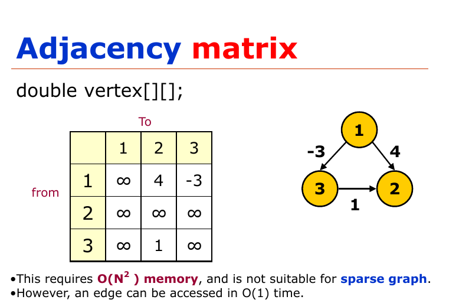
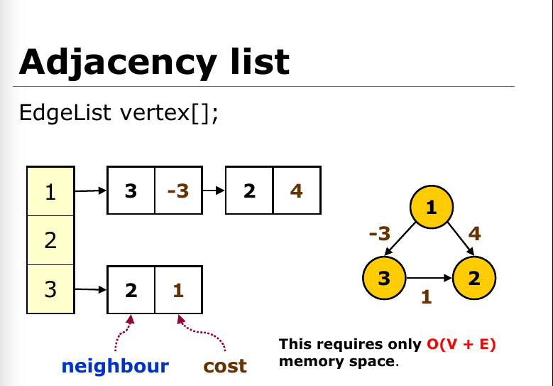

# **Graphs**

# Terms and Definition
* Path - Sequence of edges that begin at one vertex and end at another
* Cycle - A path that begins and ends at the **same vertex**

# Types of Graphs
* Directed Graph
* Weighted Directed Graphs
* Undirected Graph
*  Complete Graph

## Implementing a graph on code
There are 2 ways of implementing a graph on code:
* **Adjacency matrix**
  * Time Complexity - O(1) for accessing the array
  * Space Complexity - O(N^2)
* **Adjacent list**
  * Time Complexity - O(E)
  * Space Complexity - O(V + E)

 <br/>



### Setting up a graph
```java
// This class represents a directed graph using adjacency list 
// representation 
class Graph 
{ 
    private int V;   // No. of vertices 
    private LinkedList<Integer> adj[]; //Adjacency Lists if the vertices have order
    // If the vertices have no order e.g have strings as names use a hash map
    // private HashMap<String/Node, LinkedList<String/Node>> adj 
  
    // Constructor 
    Graph(int v) 
    { 
        V = v; 
        adj = new LinkedList[v];
        // For non order vertex
        // adj = new HashMap<String/Node>();  
        for (int i=0; i<v; ++i) 
            adj[i] = new LinkedList(); 
    } 
  
    // Function to add an edge into the graph 
    void addEdge(int v,int w) 
    { 
        adj[v].add(w);

        /* if(!adj.containsKey(v) {
          adj.put(v, new Linkedlist<String/Node>()); 
        }
        adj.get(v).add(w);
        */
    } 
```
#### Creating the node class (if necessary)
``` java
class Node {
  String name;
  boolean isVisited;

}
```
## Algorithms

### Graph Traversal

#### Breadth First Search (BFS)
> Time Complexity - O(V + E)

``` java
public void BFS(Node v){
  private Queue<Node> Q = new Queue();
  Q.add(v);
  v.isVisited = true;
  while(!Q.isEmpty()) {
    curr = Q.remove();
    System.out.println(curr);

    for(Node w : curr.getNeighbours()) {
      if(!w.isVisited) {
        Q.enqueue(w);
        w.isVisited = true;
      }
    }

  }
}
```
#### Depth First Search (DFS)
> Time Complexity - O(V + E)

``` java
public void DFS(Node v) {
  private Stack<Node> S = new Stack();
  S.push(v);
  v.isVisited = true;
  
  while(!S.isEmpty()) {
    private Node curr = S.peek();
    if(curr.getNeighbours().isEmpty()) {
      S.pop();
    }
    else {
      S.push(curr.getNeighbours().)
    }
  }
}
```
### Sorting
#### Topological Sort
```java
public void TopoSort(Graph graph) {
  Queue<Node> Q = new Queue();
  ArrayList<Node> nodeList = graph.getVertices();

  for(Node node : nodeList) {
    if (node.degree == 0) {
      Q.add(node);
    }
  }

  while(!Q.isEmpty()) {

  }
}
```

### Shortest Path

## Applications of Depth First Search
Depth-first search (DFS) is an algorithm (or technique) for traversing a graph.
Following are the problems that use DFS as a building block.

### 1) Constructs a **minimum spanning tree** and all pair shortest path tree in an **unweighted graph**.

### 2) Detecting cycle in a graph 
A graph has cycle if and only if we see a back edge during DFS. So we can run DFS for the graph and check for back edges.

### 3) Path Finding
We can specialize the DFS algorithm to find a path between two given vertices u and z.
- i) Call DFS(G, u) with u as the start vertex.
- ii) Use a stack S to keep track of the path between the start vertex and the current vertex.
- iii) As soon as destination vertex z is encountered, return the path as the
contents of the stack


### 4) Topological Sorting


### 5) To test if a graph is bipartite
We can augment either BFS or DFS when we first discover a new vertex, color it opposited its parents, and for each other edge, check it doesn’t link two vertices of the same color. The first vertex in any connected component can be red or black!

### 6) Finding Strongly Connected Components of a graph
A directed graph is called strongly connected if there is a path from each vertex in the graph to every other vertex.


## Applications of Breadth First Traversal

### 1) Shortest Path and Minimum Spanning Tree for unweighted graph 
In an unweighted graph, the shortest path is the path with least number of edges. With Breadth First, we always reach a vertex from given source using the minimum number of edges. Also, in case of unweighted graphs, any spanning tree is Minimum Spanning Tree and we can use either Depth or Breadth first traversal for finding a spanning tree.

### 2) Peer to Peer Networks
In Peer to Peer Networks like BitTorrent, Breadth First Search is used to find all neighbor nodes.

### 3) Crawlers in Search Engines
Crawlers build index using Breadth First. The idea is to start from source page and follow all links from source and keep doing same. Depth First Traversal can also be used for crawlers, but the advantage with Breadth First Traversal is, depth or levels of the built tree can be limited.

### 4) Social Networking Websites
In social networks, we can find people within a given distance ‘k’ from a person using Breadth First Search till ‘k’ levels.

### 5) GPS Navigation system
Breadth First Search is used to find all neighboring locations.

### 6) Broadcasting in Network
In networks, a broadcasted packet follows Breadth First Search to reach all nodes.

### 7) In Garbage Collection
Breadth First Search is used in copying garbage collection using Cheney’s algorithm. Refer this and for details. Breadth First Search is preferred over Depth First Search because of better locality of reference:

### 8) Cycle detection in undirected graph
In undirected graphs, either Breadth First Search or Depth First Search can be used to detect cycle. In directed graph, only depth first search can be used.

### 9) Ford–Fulkerson algorithm 
In Ford-Fulkerson algorithm, we can either use Breadth First or Depth First Traversal to find the maximum flow. Breadth First Traversal is preferred as it reduces worst case time complexity to O(VE2).

### 10) To test if a graph is Bipartite 
We can either use Breadth First or Depth First Traversal.

### 11) Path Finding
 We can either use Breadth First or Depth First Traversal to find if there is a path between two vertices.

### 12) Finding all nodes within one connected component
We can either use Breadth First or Depth First Traversal to find all nodes reachable from a given node.